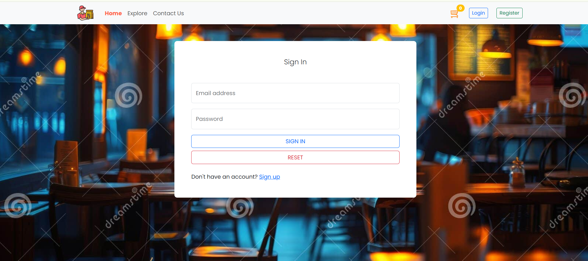
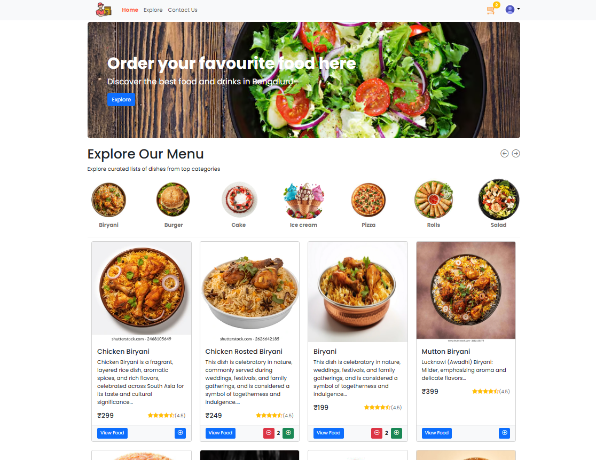
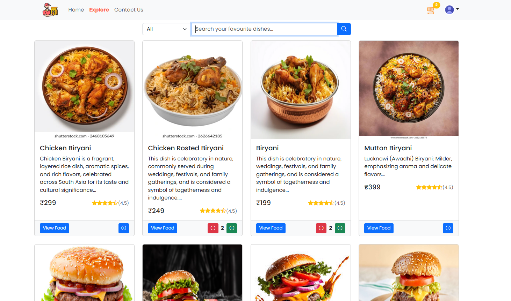
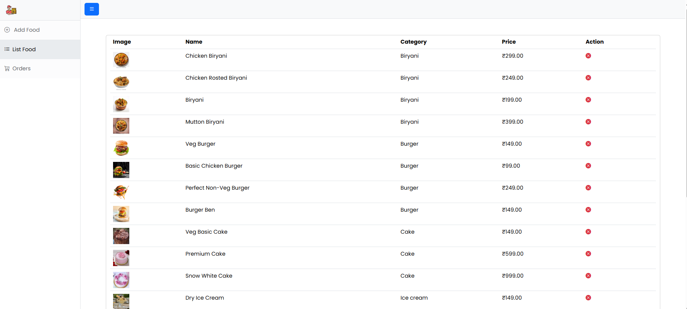
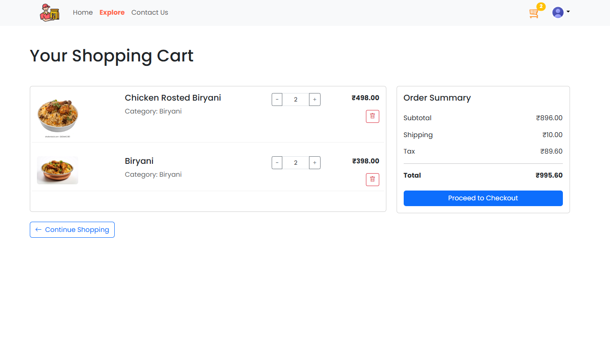
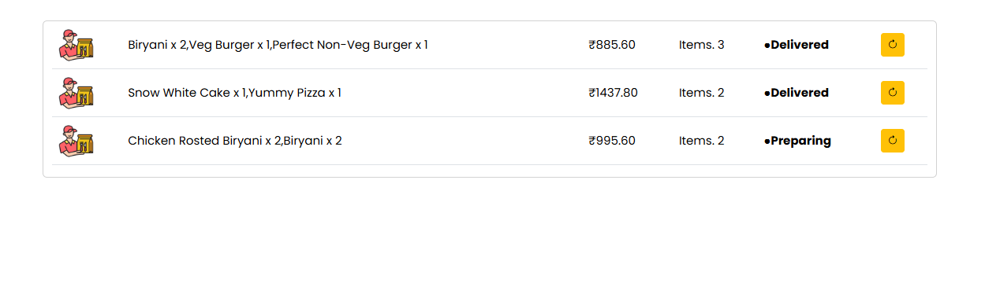
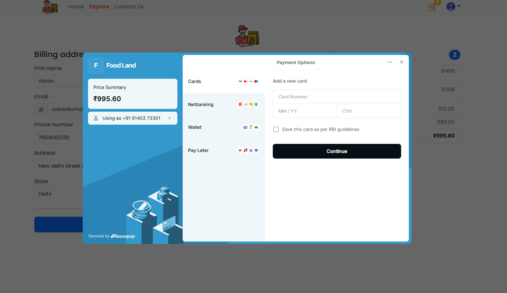
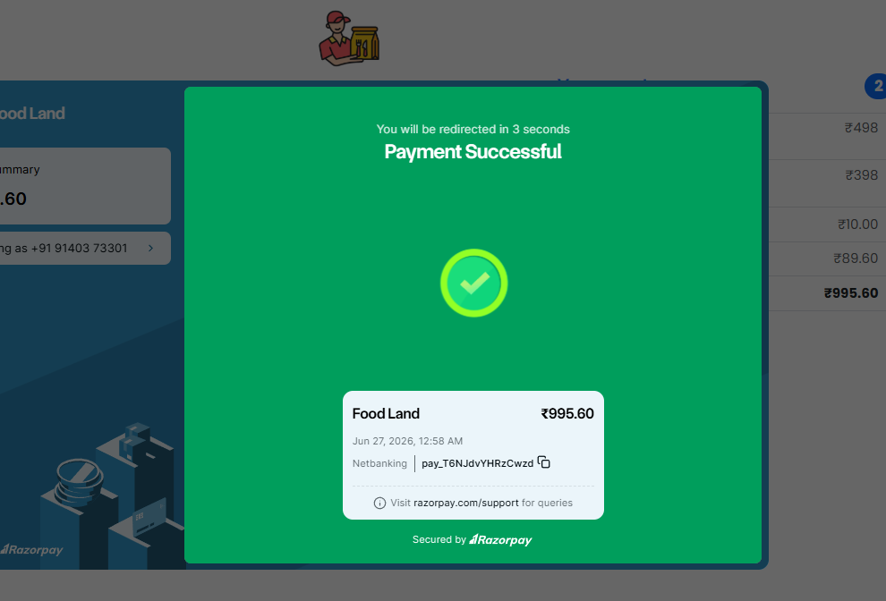

# 🍔 Quick Bite

Quick Bite is a Full Stack Food Ordering Web Application that enables users to browse food items, add them to cart, place orders, and make secure online payments using Razorpay. The application is built using Spring Boot, React, MongoDB, and AWS S3 with JWT-based authentication.

---

## ✨ Features

### 👤 User Features
- User Registration & Login
- JWT Authentication & Authorization
- Browse Food Items
- Search & Filter Foods
- Add to Cart
- Update Cart Quantity
- Place Orders
- User Profile Management

### 💳 Payment
- Secure Online Payment using Razorpay
- Payment Verification
- Order Confirmation

### 👨‍💼 Admin Features
- Admin Dashboard
- Add / Update / Delete Food Items
- Category Management
- Order Management
- User Management

### ☁️ Additional Features
- Responsive UI
- REST APIs
- Form Validation
- Exception Handling

---

# 🛠️ Tech Stack

## Frontend
- React.js
- JavaScript
- HTML5
- CSS3
- Bootstrap

## Backend
- Java 21
- Spring Boot
- Spring Security
- JWT Authentication
- Spring Data MongoDB
- Maven

## Database
- MongoDB

## Payment Gateway
- Razorpay

## Tools
- Git
- GitHub
- Postman
- IntelliJ IDEA
- VS Code

---

# 📂 Project Structure

```
quick-bite
│
├── adminpanel/
├── src/
├── pom.xml
├── package.json
├── mvnw
├── README.md
```

---

# 🚀 Installation

## Clone Repository

```bash
git clone https://github.com/Manish-70977/quick-bite.git
```

## Backend

```bash
mvn spring-boot:run
```

## Frontend

```bash
npm install
npm run dev
```

---

# 🔐 Environment Variables

Create a `.env` file and configure:

```properties
MONGODB_URI=
JWT_SECRET=

AWS_ACCESS_KEY=
AWS_SECRET_KEY=
AWS_BUCKET_NAME=

RAZORPAY_KEY_ID=
RAZORPAY_KEY_SECRET=

---

# 📸 Screenshots

### Login Page


### Home Page


### Explore Page


### Food Listing


### Cart


### Checkout


### Razorpay Payment


### Razorpay Successful Payment


### Admin Dashboard


# 🎯 Future Improvements

- Live Order Tracking
- Push Notifications
- Coupons & Offers
- Reviews & Ratings
- Docker Deployment
- Kubernetes Deployment
